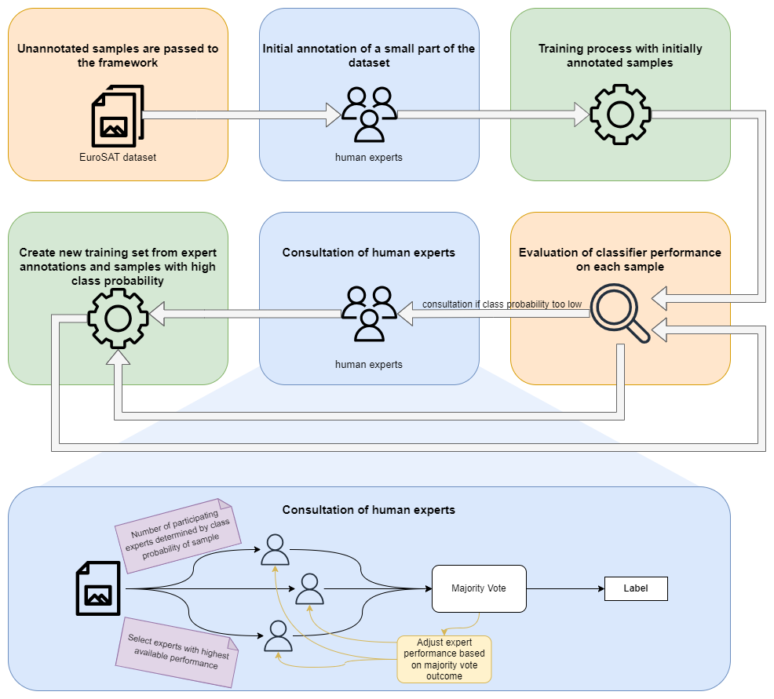

# Human-In-The-Loop Annotation Framework

## Paper

Huelser, M., Mueller, H., Díaz-Rodríguez, N. & Holzinger, A. (2025). On the disagreement problem in Human-in-the-Loop federated machine learning. Journal of Industrial Information Integration, 45, (5), 100827, https://doi.org/10.1016/j.jii.2025.100827

## Dataset

For testing purposes we use the EuroSAT dataset that provides geotagges aerial images of various places in europe. These images are labelled and classified into 10 classes. The dataset is available [here](https://github.com/phelber/EuroSAT) [1] [2].

## Framework

The framwork can be run by importing the `HITLAnnotator` class. This class provides access to the `train_classifier_with_human_in_the_loop` method. All neccessary parameters have to be passed to the constructor of the `HITLAnnotator` class as described in the code comments. In addition to that, the framework requires the setup of some instances of the `Annotator` class which can also be imported from the `framework.py` file in the framework folder, whereas one instance of this class represents one human expert taking part int he annotation process. Please find a setup of the framework that serves as an example in the `example.py` file of the framework folder.

## References

[1] Eurosat: A novel dataset and deep learning benchmark for land use and land cover classification. Patrick Helber, Benjamin Bischke, Andreas Dengel, Damian Borth. IEEE Journal of Selected Topics in Applied Earth Observations and Remote Sensing, 2019.

[2] Introducing EuroSAT: A Novel Dataset and Deep Learning Benchmark for Land Use and Land Cover Classification. Patrick Helber, Benjamin Bischke, Andreas Dengel. 2018 IEEE International Geoscience and Remote Sensing Symposium, 2018.
